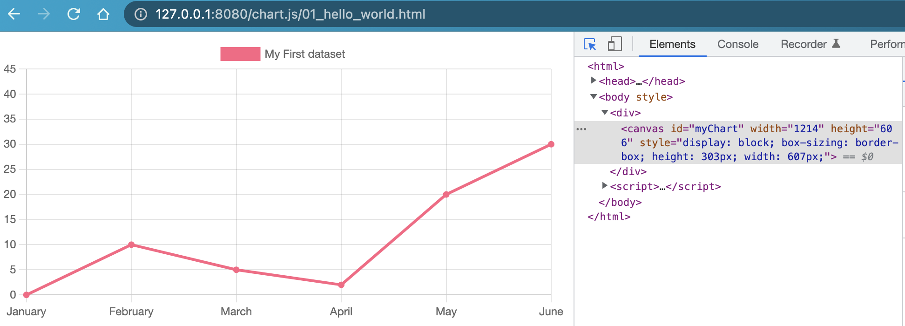

# Chart.js

[TOC]

## 1、关于Chart.js

Chart.js[^1]是处理图表显示的js库，支持npm、CDN，以及React、Vue等使用方式。

支持的图表类型有

* Area Chart
* Bar Chart
* Bubble Chart
* Doughnut and Pie Charts
* Line Chart
* Mixed Chart Types
* Polar Area Chart
* Radar Chart
* Scatter Chart


### (1) HelloWorld示例

这里以CDN方式作为示例[^2]，如下

```html
<head>
  <script src="https://cdn.jsdelivr.net/npm/chart.js"></script>
  <script>
    const labels = [
      'January',
      'February',
      'March',
      'April',
      'May',
      'June',
    ];

    const data = {
      labels: labels,
      datasets: [{
        label: 'My First dataset',
        backgroundColor: 'rgb(255, 99, 132)',
        borderColor: 'rgb(255, 99, 132)',
        data: [0, 10, 5, 2, 20, 30, 45],
      }]
    };

    const config = {
      type: 'line',
      data: data,
      options: {}
    };
  </script>
</head>

<body>
  <div>
    <canvas id="myChart"></canvas>
  </div>
</body>

<script>
  const myChart = new Chart(
    document.getElementById('myChart'),
    config
  );
</script>
```

渲染的图表如下



说明

> 1. Chart.js使用canvas标签渲染图表
> 2. 图表中图例，例如MyFirst dataset，是可点击的


### (2) 安装Chart.js

Chart.js支持下面几种安装方式


#### a. npm安装包

```shell
$ npm install chart.js
```


#### b. 引用CDN地址

有2个CDN源分别是

* CDNJS。在https://cdnjs.com/libraries/Chart.js这个页面，获取特定版本的js库。例如

```
https://cdnjs.cloudflare.com/ajax/libs/Chart.js/3.9.1/chart.min.js
```


*  jsDelivr。在https://www.jsdelivr.com/package/npm/chart.js?path=dist这个页面，获取特定版本的js库。例如

```
https://cdn.jsdelivr.net/npm/chart.js@3.9.1/dist/chart.min.js
```


#### c. 使用Github上的源码引入

这里暂不介绍。


### (3) 集成Chart.js

集成Chart.js，即如何将这个库，引入到代码中。不同的开发环境，引入方式不一样。

官方文档[^3]给了下面几种集成方式，如下


#### a. Script Tag

```html
<script src="path/to/chartjs/dist/chart.js"></script>
<script>
    const myChart = new Chart(ctx, {...});
</script>
```


#### b. Common JS

```javascript
const Chart = require('chart.js');
const myChart = new Chart(ctx, {...});
```


#### c. Bunnlers (Webpack, Rollup, etc.)

这里不介绍参考官方文档[^3]


### (4) 通用使用步骤

官方文档[^4]介绍了一个通用使用步骤，可以支持ES6 modules、plain JavaScript以及module loaders。

主要下面几个步骤

* 引入Chart.js。在集成Chart.js一节已经介绍。
* 确定canvas标签
* 初始化Chart对象


这里以plain JavaScript为例，示例代码，如下

```html
<head>
  <!-- Step 1: Import the Chart.js library -->
  <script src="https://cdn.jsdelivr.net/npm/chart.js@3.9.1/dist/chart.min.js"></script>
</head>

<body>
  <div>
    <!-- Step 2: Place the canvas tag -->
    <canvas id="myChart"></canvas>
  </div>
</body>

<script>
  // Step 3: Create the Chart object
  const ctx = document.getElementById('myChart');
  const myChart = new Chart(ctx, {
    type: 'bar',
    data: {
      labels: ['Red', 'Blue', 'Yellow', 'Green', 'Purple', 'Orange'],
      datasets: [{
        label: '# of Votes',
        data: [12, 19, 3, 5, 2, 3],
        backgroundColor: [
          'rgba(255, 99, 132, 0.2)',
          'rgba(54, 162, 235, 0.2)',
          'rgba(255, 206, 86, 0.2)',
          'rgba(75, 192, 192, 0.2)',
          'rgba(153, 102, 255, 0.2)',
          'rgba(255, 159, 64, 0.2)'
        ],
        borderColor: [
          'rgba(255, 99, 132, 1)',
          'rgba(54, 162, 235, 1)',
          'rgba(255, 206, 86, 1)',
          'rgba(75, 192, 192, 1)',
          'rgba(153, 102, 255, 1)',
          'rgba(255, 159, 64, 1)'
        ],
        borderWidth: 1
      }]
    },
    options: {
      scales: {
        y: {
          beginAtZero: true
        }
      }
    }
  });
</script>
```


这里Chart初始化函数，有2个参数

* ctx，即canvas对象
* map对象，里面有type、data和options参考
  * type，决定图表的类型
  * data，渲染图表需要的数据
  * options，一些额外的配置参数


## 2、通用能力

### (1) Accessibility

canvas标签不是所有浏览器都支持，因此需要处理不支持canvas标签的情况。

官方文档[^5]推荐下面2种方式处理降级


#### a. 设置aria-label和role属性

```html
<canvas id="goodCanvas1" width="400" height="100" aria-label="Hello ARIA World" role="img"></canvas>
```


#### b. 设置内嵌的文本

```html
<canvas id="okCanvas2" width="400" height="100">
    <p>Hello Fallback World</p>
</canvas>
```


### (2) Color

Chart.js支持颜色以字符串形式，内容是十六进制、RGB或者HSL。如果不设置颜色，Chart.js有默认的全局颜色。

可以参考下面表格

| Name              | Type    | Default              | Description       |
| ----------------- | ------- | -------------------- | ----------------- |
| `backgroundColor` | `Color` | `rgba(0, 0, 0, 0.1)` | Background color. |
| `borderColor`     | `Color` | `rgba(0, 0, 0, 0.1)` | Border color.     |
| `color`           | `Color` | `#666`               | Font color.       |

也可以支持pattern和gradient颜色，参考官方文档[^6]


### (3) Data structures

在上面提到，初始化Chart对象时，有一个data参数，它用于输入渲染图表的数据。

data参数包含2个参数，如下

* datasets参数，用于图表的数据。
* labels参数，用于图表的index轴（默认是x轴）上索引

注意

> datasets参数内部还有一个data参数

举个例子，如下

```html
<head>
  <script src="../vendor/chart.js@3.9.1/chart.min.js"></script>
</head>

<body>
  <h2>Data structure - primitive structure</h2>
  <div>
    <canvas id="myChart"></canvas>
  </div>
</body>

<script>
  const ctx = document.getElementById('myChart');
  const chart = new Chart(ctx, {
    type: 'bar',
    data: {
      datasets: [{
        data: [20, 10],
      }],
      labels: ['a', 'b']
    }
  });
</script>
```


#### a. 使用Object对象数组

在上面的例子中，datasets参数是一个整型数组。这里可以换成Object对象数组。

注意

> Object对象必须包含x和y属性，Chart.js内部默认会读取这些属性值。

举几个例子，如下

```html
<head>
  <script src="../vendor/chart.js@3.9.1/chart.min.js"></script>
</head>

<body>
  <h2>Data structure - datasets use object 1</h2>
  <div>
    <canvas id="myChart"></canvas>
  </div>
</body>

<script>
  const ctx = document.getElementById('myChart');
  const chart = new Chart(ctx, {
    type: 'line',
    data: {
      datasets: [{
        data: [{ x: '10', y: 20 }, { x: '15', y: 25 }, { x: '20', y: 10 }]
      }]
    }
  });
</script>
```

注意

> 上面例子改造自官方例子，这里x的值，不能是整型，必须是字符串。

替换初始化Chart对象，如下

```html
<script>
  const ctx = document.getElementById('myChart');
  const chart = new Chart(ctx, {
    type: 'line',
    data: {
      datasets: [{
        data: [{ x: '2016-12-25', y: 20 }, { x: '2016-12-26', y: 10 }]
      }]
    }
  });
</script>
```

或者

```html
<script>
  const ctx = document.getElementById('myChart');
  const chart = new Chart(ctx, {
    type: 'bar',
    data: {
      datasets: [{
        data: [{ x: 'Sales', y: 20 }, { x: 'Revenue', y: 10 }]
      }]
    }
  });
</script>
```


#### b. 使用自定义Object对象数组

在上面提到Chart.js默认支持的Object，包含x和y属性。但是也支持自定义属性，同时需要指定解析这些属性的path。

举个例子，如下

```html
<head>
  <script src="../vendor/chart.js@3.9.1/chart.min.js"></script>
</head>

<body>
  <h2>Data structure - datasets use custom object</h2>
  <div>
    <canvas id="myChart"></canvas>
  </div>
</body>

<script>
  const ctx = document.getElementById('myChart');
  const chart = new Chart(ctx, {
    type: 'bar',
    data: {
      datasets: [{
        data: [{ id: 'Sales', nested: { value: 1500 } }, { id: 'Purchases', nested: { value: 500 } }]
      }]
    },
    options: {
      parsing: {
        xAxisKey: 'id',
        yAxisKey: 'nested.value'
      }
    }
  });
</script>
```

xAxisKey属性和yAxisKey属性，适用于二维坐标的图表。如果是一维图表，例如饼状图，则使用key属性。举个例子，如下

```html
<head>
  <script src="../vendor/chart.js@3.9.1/chart.min.js"></script>
</head>

<body>
  <h2>Data structure - datasets use custom object</h2>
  <div>
    <canvas id="myChart"></canvas>
  </div>
</body>

<script>
  const ctx = document.getElementById('myChart');
  const chart = new Chart(ctx, {
    type: 'doughnut',
    data: {
      datasets: [{
        data: [{ id: 'Sales', nested: { value: 1500 } }, { id: 'Purchases', nested: { value: 500 } }]
      }]
    },
    options: {
      parsing: {
        key: 'nested.value'
      }
    }
  });
</script>
```


说明

> 如果解析的key，包括`.`，则使用转义方式。
>
> 举个例子，如下
>
> ```javascript
> type: 'line',
> data: {
>     datasets: [{
>         data: [{ 'data.key': 'one', 'data.value': 20 }, { 'data.key': 'two', 'data.value': 30 }]
>     }]
> },
> options: {
>     parsing: {
>       xAxisKey: 'data\\.key',
>       yAxisKey: 'data\\.value'
>     }
> }
> ```
>
> 


#### c. dataset字段的配置

dataset字段的配置[^7]，如下

| Name      | Type               | Description                                                  |
| --------- | ------------------ | ------------------------------------------------------------ |
| `label`   | `string`           | The label for the dataset which appears in the legend and tooltips. |
| `clip`    | `number`|`object`  | How to clip relative to chartArea. Positive value allows overflow, negative value clips that many pixels inside chartArea. 0 = clip at chartArea. Clipping can also be configured per side: clip: {left: 5, top: false, right: -2, bottom: 0} |
| `order`   | `number`           | The drawing order of dataset. Also affects order for stacking, tooltip and legend. |
| `stack`   | `string`           | The ID of the group to which this dataset belongs to (when stacked, each group will be a separate stack). Defaults to dataset `type`. |
| `parsing` | `boolean`|`object` | How to parse the dataset. The parsing can be disabled by specifying parsing: false at chart options or dataset. If parsing is disabled, data must be sorted and in the formats the associated chart type and scales use internally. |
| `hidden`  | `boolean`          | Configure the visibility of the dataset. Using `hidden: true` will hide the dataset from being rendered in the Chart. |

举一个较复杂的例子，如下

```html
<head>
  <script src="../vendor/chart.js@3.9.1/chart.min.js"></script>
</head>

<body>
  <h2>Data structure - bar chart example</h2>
  <div>
    <canvas id="myChart"></canvas>
  </div>
</body>

<script>
  const data = [{ x: 'Jan', net: 100, cogs: 50, gm: 50 }, { x: 'Feb', net: 120, cogs: 55, gm: 75 }];
  const cfg = {
    type: 'bar',
    data: {
      labels: ['Jan', 'Feb'],
      datasets: [{
        label: 'Net sales',
        data: data,
        parsing: {
          yAxisKey: 'net'
        }
      }, {
        label: 'Cost of goods sold',
        data: data,
        parsing: {
          yAxisKey: 'cogs'
        }
      }, {
        label: 'Gross margin',
        data: data,
        parsing: {
          yAxisKey: 'gm'
        }
      }]
    },
  };

  const ctx = document.getElementById('myChart');
  const chart = new Chart(ctx, cfg);
</script>
```

简单描述下这个图表，x轴是Jan和Feb 2个分组，每个组都有'Net sales'、'Cost of goods sold'和'Gross margin'。

说明

> 这里也使用parsing属性，但不在options属性中，可见options属性，更像是一个全局配置。这里parsing属性，针对每个bar数据来解析。


### (4) Fonts

#### a. 全局设置字体

举个例子，如下

```javascript
Chart.defaults.font.size = 16;
```

说明

> 在初始化Chart对象之前，设置好


#### b. 局部设置字体

举个例子，如下

```javascript
let chart = new Chart(ctx, {
    type: 'line',
    data: data,
    options: {
        plugins: {
            legend: {
                labels: {
                    // This more specific font property overrides the global property
                    font: {
                        size: 14
                    }
                }
            }
        }
    }
});
```

这里设置legend的字体，而不影响x轴和y轴上元素的字体。


#### c. 字体配置

官方文档描述[^8]，如下

| Name         | Type              | Default                                                | Description                                                  |
| ------------ | ----------------- | ------------------------------------------------------ | ------------------------------------------------------------ |
| `family`     | `string`          | `"'Helvetica Neue', 'Helvetica', 'Arial', sans-serif"` | Default font family for all text, follows CSS font-family options. |
| `size`       | `number`          | `12`                                                   | Default font size (in px) for text. Does not apply to radialLinear scale point labels. |
| `style`      | `string`          | `'normal'`                                             | Default font style. Does not apply to tooltip title or footer. Does not apply to chart title. Follows CSS font-style options (i.e. normal, italic, oblique, initial, inherit). |
| `weight`     | `string`          | `undefined`                                            | Default font weight (boldness). (see [MDN](https://developer.mozilla.org/en-US/docs/Web/CSS/font-weight)). |
| `lineHeight` | `number`|`string` | `1.2`                                                  | Height of an individual line of text (see [MDN](https://developer.mozilla.org/en-US/docs/Web/CSS/line-height)). |


### (5) Options

Chart.js定义多个级别的Option，根据上下文环境，从外到内，来处理这些Option，最终确定Option的值。

官方文档[^9]，提到下面几个级别的Option

* Chart level options
* Dataset level options
* Dataset animation options
* Dataset element level options
* Scale options
* Plugin options


### (6) Padding

Chart.js允许设置一些padding。

有下面几种方式[^10]

#### a. 直接设置数值

举个例子，如下

```javascript
let chart = new Chart(ctx, {
    type: 'line',
    data: data,
    options: {
        layout: {
            padding: 20
        }
    }
});
```


#### b. 设置{top, left, bottom, right} object

举个例子，如下

```javascript
let chart = new Chart(ctx, {
    type: 'line',
    data: data,
    options: {
        layout: {
            padding: {
                left: 50
            }
        }
    }
});
```


#### c. 设置 {x, y} object

举个例子，如下

```javascript
let chart = new Chart(ctx, {
    type: 'radar',
    data: data,
    options: {
        scales: {
          r: {
            ticks: {
              backdropPadding: {
                  x: 10,
                  y: 4
              }
            }
        }
    }
});
```


### (7) Performance

TODO: https://www.chartjs.org/docs/latest/general/performance.html


## 2、Line Charts


## 3、Bar Charts


## References

[^1]:https://www.chartjs.org/docs/latest/
[^2]:https://www.chartjs.org/docs/latest/getting-started/
[^3]:https://www.chartjs.org/docs/latest/getting-started/integration.html
[^4]:https://www.chartjs.org/docs/latest/getting-started/usage.html
[^5]:https://www.chartjs.org/docs/latest/general/accessibility.html
[^6]:https://www.chartjs.org/docs/latest/general/colors.html
[^7]:https://www.chartjs.org/docs/latest/general/data-structures.html
[^8]:https://www.chartjs.org/docs/latest/general/fonts.html
[^9]:https://www.chartjs.org/docs/latest/general/options.html
[^10]:https://www.chartjs.org/docs/latest/general/padding.html


