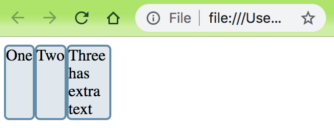

# CSS Flexbox Layout

[TOC]

---


## 1、Flexbox语法[^1]

flexbox是CSS的一种布局方式，通过声明`display`为`flex`，让浏览器按照flexbox布局。


### （1）主轴和侧轴

flexbox有主轴 (main axe)和侧轴 (cross axe)的概念。

`flex-direction`属性定义主轴的方向，默认是`row`。有下面几种

* row，水平方向，从左到右
* row-reverse，水平方向，从右到左
* column，垂直方向，从上到下
* column-reverse，垂直方向，从下到上

而侧轴总是垂直于主轴。

示例代码，见**01_flow-direction.html**

> flex-direction定义的方向，都是从start edge到end edge。不同的语言，才体现出Left-to-Right，还是Right-to-Left。例如当语言为English时，flex-diection: row，则是水平方向，从左到右；当语言为Arabic时，flex-diection: row，则是水平方向，从右到左。


### （2）flex容器 (flex container)

​        当对div标签，声明display属性声明为`flex`或者`inline-flex`，则该div是一个flex container，它里面的子标签（后面称为item）都会按照flexbox方式布局。

​        一般声明`display: flex`，默认会初始化一些属性值，表现的行为，如下

- Items display in a row (the `flex-direction` property's default is `row`).
  - item显示是一行
- The items start from the start edge of the main axis.
  - item在主轴上从start edge开始排列
- The items do not stretch on the main dimension, but can shrink.
  - 每个item在主轴方向上不拉伸，但是可以压缩
- The items will stretch to fill the size of the cross axis.
  - 每个item可以在侧轴上拉伸
- The [`flex-basis`](https://developer.mozilla.org/en-US/docs/Web/CSS/flex-basis) property is set to `auto`.
  - `flex-basis`属性默认是auto
- The [`flex-wrap`](https://developer.mozilla.org/en-US/docs/Web/CSS/flex-wrap) property is set to `nowrap`.
  - flex-wrap属性默认是nowrap

以**02_flow container.html**，为例

```html
<style>
    .box>* {
        border: 2px solid rgb(96, 139, 168);
        border-radius: 5px;
        background-color: rgba(96, 139, 168, .2);
    }

    .box {
        display: flex;
    }
</style>

<div class="box">
    <div class="one">One</div>
    <div class="two">Two</div>
    <div>Three
        <br>has
        <br>extra
        <br>text
    </div>
</div>
```

在Chrome的表现，如下



* 在主轴上，如果没指定width，每个item总是自适应内容的宽度
* 在侧轴上，每个item自动拉伸，满足其中一个item的最大高度。这里第三个item有最大高度，前两个item的高度自动拉伸来满足这个最大高度。
* 在主轴上，flex-wrap属性设置为`nowrap`，则item超出容器时，不自动换行，而设置为`wrap`，则item超出容器时，按照侧轴方向自动换行。示例代码，见**03_flow-wrap.html**。

> flex-direction和flex-wrap可以用`flex-flow`来代替，`flex-flow`有两个值用空格分隔，前者是flex-direction，后者是flex-wrap


### （3）flex item比例分配

flex容器中item，称之为**flex item**。多个flex item在主轴上排列，需要确定每个item的大小。flexbox提供三个属性`flex-basis`、`flex-grow`、`flex-shrink`，用于控制比例分配。


* `flex-basis`：What is the size of the item before growing and shrinking happens?
  * item在grow或shrink之前的大小
* `flex-grow`：How much of the positive free space does this item get?
  * item获取多少多余的正空间
* `flex-shrink`：How much negative free space can be removed from this item?
  * item获取多少多余的负空间

以上三个属性，通常用一个shorthand属性`flex`来表示。


## 附录

### 1、flexbox属性表

| 属性名           | 含义                                         | 属性值                          | 默认值   | 说明 |
| :--------------- | -------------------------------------------- | ------------------------------- | -------- | ---- |
| `display`        |                                              | `flex/inline-flex`              |          |      |
| `flex-direction` | 主轴方向                                     | row/                            |          |      |
| `flex-wrap`      | 换行方式                                     | `wrap/nowrap`                   | `nowrap` |      |
| `flex-flow`      | `flex-direction`和`flex-wrap`的shorthand属性 | flex-direction和flex-wrap的组合 |          |      |
| `flex-basis`     |                                              |                                 |          |      |
| `flex-grow`      |                                              |                                 |          |      |
| `flex-shrink`    |                                              |                                 |          |      |
| `flex`           |                                              |                                 |          |      |


## References

[^1]: https://developer.mozilla.org/en-US/docs/Web/CSS/CSS_Flexible_Box_Layout/Basic_Concepts_of_Flexbox

