# Hello Mermaid-js

[TOC]

## 1、关于Mermaid-js

Mermaid-js是一个js库，用于通过文本和代码，来创建可视化的图表。

官方文档对Mermaid的定义[^1]，如下

> **Mermaid lets you create diagrams and visualizations using text and code.**
>
> It is a JavaScript based diagramming and charting tool that renders Markdown-inspired text definitions to create and modify diagrams dynamically.


### (1) 诞生原因

Mermaid-js库的诞生原因，即为什么要创建Mermaid-js库来制作图表的原因。

官方给出的原因，如下

> The main purpose of Mermaid is to help documentation catch up with development.
>
> Diagramming and documentation costs precious developer time and gets outdated quickly. But not having diagrams or docs ruins productivity and hurts organizational learning.
> Mermaid addresses this problem by enabling users to create easily modifiable diagrams, it can also be made part of production scripts (and other pieces of code).

简单归纳以下几点

* Mermaid让文档和开发保持与时俱进，避免文档落后开发内容很多
* 编写文档是比较耗费开发宝贵时间的，但是没有文档又会影响其他人学习和沟通，Mermaid让文档更新变得很快
* Mermaid可以作为组件，集成到其他生产环境中


### (2) 集成方式

Mermaid-js支持集成到多种生产环境中，如下

| 容器     | 方式                                                    | 说明 |
| -------- | ------------------------------------------------------- | ---- |
| HTML页面 | `<script></script>`标签方式                             |      |
| webpack  | TODO                                                    |      |
| React    | TODO： https://github.com/mermaid-js/mermaid/issues/717 |      |
| Typora   |                                                         |      |


### (3) 相关学习资料

GitHub源码：https://github.com/mermaid-js/mermaid


## 2、HTML中使用mermaid-js

### (1) CDN下载地址

mermaid-js的生产代码，托管在https://unpkg.com/mermaid/上，如下


可以在上面这个网站找到对应版本的CDN地址，用于script标签上。

说明

> 如果不放心，CDN url可能会被墙，或者访问下载慢，也可以直接下载js文件到本地使用。


### (2) Hello, world示例

结合官方文档提供的代码[^2]，作为Hello, world示例，如下

```html
<!DOCTYPE html>
<html>

<body>
  <div class="mermaid">
    graph TD
    A[Client] --> B[Load Balancer]
    B --> C[Server01]
    B --> D[Server02]
  </div>

  <script src="https://cdn.jsdelivr.net/npm/mermaid/dist/mermaid.min.js"></script>
  <script>
    mermaid.initialize({
      startOnLoad: true,
    });
  </script>
</body>

</html>
```

在浏览器中的显示，如下


这里暂时不讨论mermaid图表语法。主要介绍完成mermaid图表显示的步骤，如下

* 定义好div标签，同时设置它class属性为mermaid。在div中，写入Mermaid text definitions
* 加载mermaid-js库
* 初始化mermaid

说明

> 1. Mermaid text definitions，也称为Mermaid definitions，是官方采用的术语，即mermaid图表语法代码
> 2. 加载mermaid-js库，可以从远端加载，也可以本地加载。这里使用CDN地址，https://cdn.jsdelivr.net/npm/mermaid/dist/mermaid.min.js，应该是官方提供的，总是指向最新版本的。自己的生成环境，可以使用固定版本号。
> 3. mermaid对象，是mermaid-js库提供的全局对象


mermaid对象的initialize方法，用于初始化mermaid，它接收一些参数，比如startOnLoad参数

startOnLoad参数用于决定在page加载时，是否将带有class="mermaid"的div渲染成diagram。

官方文档描述[^3]，如下

> [startOnLoad](https://mermaid-js.github.io/mermaid/#/Setup?id=startonload)
>
> | Parameter   | Description                                  | Type    | Required | Values      |
> | ----------- | -------------------------------------------- | ------- | -------- | ----------- |
> | startOnLoad | Dictates whether mermaid starts on Page load | boolean | Required | true, false |
>
> **Notes:** Default value: true


### (3) 手动渲染

除了指定startOnLoad参数为true，让mermaid自动处理对应div的渲染，也可以手动调用API自己来处理。

举个例子[^4]，如下

```html
<!DOCTYPE html>
<html>

<head>
  <title>manually render into svg</title>
</head>

<body>
  <div id="graphDiv">
  </div>

  <script src="../vendor/mermaid.min.js"></script>
  <script>
    var mermaidAPI = mermaid.mermaidAPI;

    mermaidAPI.initialize({
      startOnLoad: false
    });

    var element = document.getElementById("graphDiv");
    var insertSvg = function (svgCode, bindFunctions) {
      element.innerHTML = svgCode;
    };
    var graphDefinition = 'graph TB\na-->b';
    var graph = mermaidAPI.render("mermaid", graphDefinition, insertSvg);
  </script>
</body>

</html>
```

手动渲染时可以不用设置div的class为mermaid，


### (4) initialize函数的参数

在上面的例子中，无论使用mermaid对象，还是mermaidAPI对象，都可以使用initialize函数完成初始化

官方给了一个默认的配置示例[^6]，如下

```javascript
<script>
  var config = {
    theme: 'default',
    logLevel: 'fatal',
    securityLevel: 'strict',
    startOnLoad: true,
    arrowMarkerAbsolute: false,

    er: {
      diagramPadding: 20,
      layoutDirection: 'TB',
      minEntityWidth: 100,
      minEntityHeight: 75,
      entityPadding: 15,
      stroke: 'gray',
      fill: 'honeydew',
      fontSize: 12,
      useMaxWidth: true,
    },
    flowchart: {
      diagramPadding: 8,
      htmlLabels: true,
      curve: 'basis',
    },
    sequence: {
      diagramMarginX: 50,
      diagramMarginY: 10,
      actorMargin: 50,
      width: 150,
      height: 65,
      boxMargin: 10,
      boxTextMargin: 5,
      noteMargin: 10,
      messageMargin: 35,
      messageAlign: 'center',
      mirrorActors: true,
      bottomMarginAdj: 1,
      useMaxWidth: true,
      rightAngles: false,
      showSequenceNumbers: false,
    },
    gantt: {
      titleTopMargin: 25,
      barHeight: 20,
      barGap: 4,
      topPadding: 50,
      leftPadding: 75,
      gridLineStartPadding: 35,
      fontSize: 11,
      fontFamily: '"Open Sans", sans-serif',
      numberSectionStyles: 4,
      axisFormat: '%Y-%m-%d',
      topAxis: false,
    },
  };
  mermaid.initialize(config);
</script>
```


#### a. securityLevel参数

securityLevel参数是一个通用参数，它的值下面几种[^6]

| Parameter     | Description                       | Type   | Required | Values                          |
| ------------- | --------------------------------- | ------ | -------- | ------------------------------- |
| securitylevel | Level of trust for parsed diagram | string | Required | 'strict', 'loose', 'antiscript' |

**Notes**:

- **strict**: (**default**) tags in text are encoded, click functionality is disabled
- **loose**: tags in text are allowed, click functionality is enabled
- **antiscript**: html tags in text are allowed, (only script element is removed), click functionality is enabled


## 3、流程图 (Flow Chart)

流程图 (Flow Chart)是mermaid-js支持最常见的一种图表。

mermaid图表语法代码，用`flowchart`来表示流程图

说明

> 一些历史的mermaid示例中，也看到用`graph`来表示流程图，但是官方最新文档已经换成使用`flowchart`


### (1) 定义一个节点

举个例子，如下

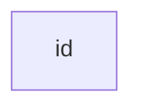

### (2) 节点自定义文本

举个例子，如下

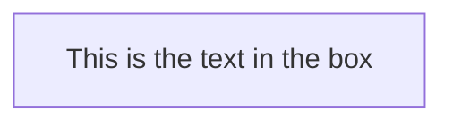

### (3) 流程图方向

流程图方向，是所有节点串联的方向。支持下面几种方向，如下

- TB - top to bottom
- TD - top-down/ same as top to bottom
- BT - bottom to top
- RL - right to left
- LR - left to right


举个例子，如下

* 自上而下的方向 (TB/TD)

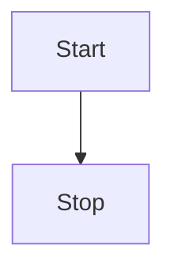

* 从左到右的方向 (LR)

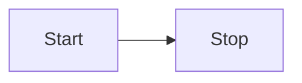


### (4) 节点形状

使用特殊的字符组合，可以定义一些节点的形状

举一些例子，如下

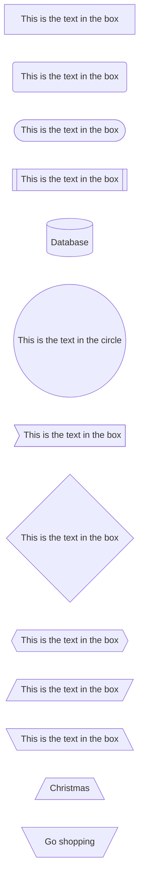

还有一些例子 (可能typora不支持)，如下

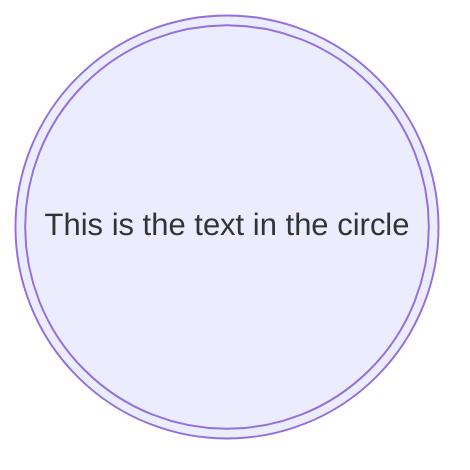


### (5) 节点的连接线

节点的连接线，也是支持很多样式。这里举一些例子，如下

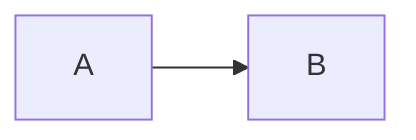

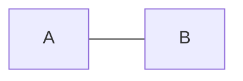

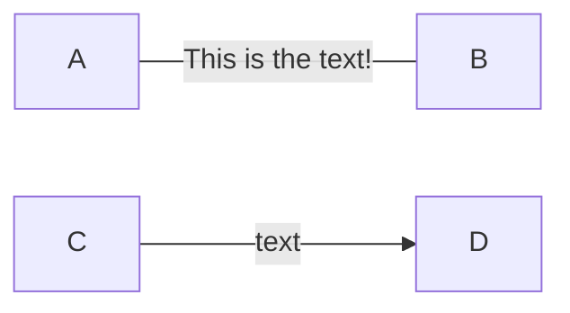

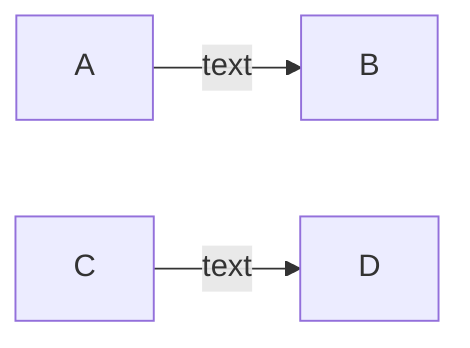


```mermaid
sdfds
```


##4、甘特图 (Gantt Charts)

甘特图 (Gantt Charts)的展示，示例如下

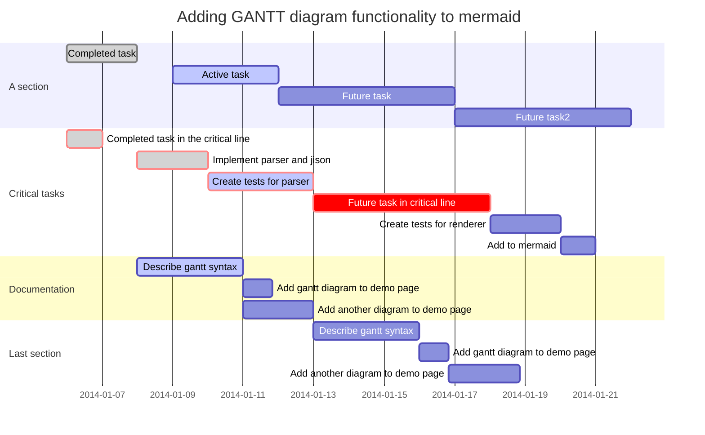

甘特图(Gantt diagram)是一种条线的图表，用于显示工程上的日程以及每个工程的耗时。甘特图也显示每个元素的起始时间和结束时间，以及每个工程的摘要信息。

mermaid文档对甘特图的描述[^5]，如下

> A Gantt chart is a type of bar chart, first developed by Karol Adamiecki in 1896, and independently by Henry Gantt in the 1910s, that illustrates a project schedule and the amount of time it would take for any one project to finish. Gantt charts illustrate number of days between the start and finish dates of the terminal elements and summary elements of a project.


### (1) 图表的标题(Title)

用title字段描述甘特图的标题，它是可选的

举个例子，如下

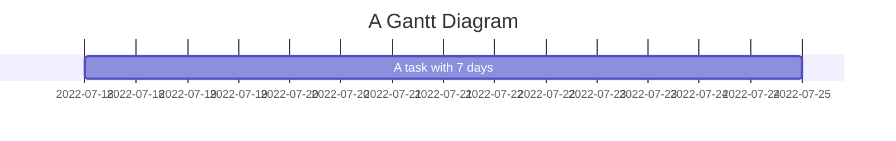

### (2) 区块语句(Section statements)

可以将图表分成多个区块(section)，比如一个项目分为开发阶段和文档阶段。

使用section字段，后面跟着一个名字。名字是必选的。

举个例子，如下

```mermaid
gantt
	title A Gantt Diagram
	dateFormat YYYY-MM-DD
	section section for development
	A task with 7 days :a1, 2022-07-18, 7d
	section section for documentation
	A task with 2 days :a2, 2d
```


### (3) 里程碑(Milestones)

使用milestone字段可以标记一个里程碑。

举个例子，如下

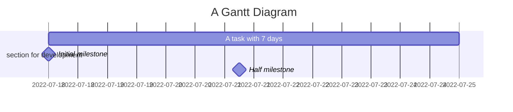

里程碑的时间计算规则是`initial date+duration/2`，这里duration是指里程碑耗费的时间。举个例子，如下

```
Half milestone :milestone, m2, 2022-07-21, 12h
```

上面12h是指里程碑耗费0.5天时间。


### (4) 设置日期(Setting dates)

`dateFormat`字段用于定义输入时间的格式。默认格式为YYYY-MM-DD

`axisFormat`字段用于定义输出时间的格式。默认格式为YYYY-MM-DD


`dateFormat`字段用法，如下

```
dateFormat YYYY-MM-DD
```


`dateFormat`字段支持的时间格式，如下

```
Input       Example             Description:
YYYY        2014                4 digit year
YY          14                  2 digit year
Q           1..4                Quarter of year. Sets month to first month in quarter.
M MM        1..12               Month number
MMM MMMM    January..Dec        Month name in locale set by moment.locale()
D DD        1..31               Day of month
Do          1st..31st           Day of month with ordinal
DDD DDDD    1..365              Day of year
X           1410715640.579      Unix timestamp
x           1410715640579       Unix ms timestamp
H HH        0..23               24 hour time
h hh        1..12               12 hour time used with a A.
a A         am pm               Post or ante meridiem
m mm        0..59               Minutes
s ss        0..59               Seconds
S           0..9                Tenths of a second
SS          0..99               Hundreds of a second
SSS         0..999              Thousandths of a second
Z ZZ        +12:00              Offset from UTC as +-HH:mm, +-HHmm, or Z
```


`axisFormat`字段用法，如下

```
axisFormat  %Y-%m-%d
```


`axisFormat`字段支持的时间格式，如下

```
%a - abbreviated weekday name.
%A - full weekday name.
%b - abbreviated month name.
%B - full month name.
%c - date and time, as "%a %b %e %H:%M:%S %Y".
%d - zero-padded day of the month as a decimal number [01,31].
%e - space-padded day of the month as a decimal number [ 1,31]; equivalent to %_d.
%H - hour (24-hour clock) as a decimal number [00,23].
%I - hour (12-hour clock) as a decimal number [01,12].
%j - day of the year as a decimal number [001,366].
%m - month as a decimal number [01,12].
%M - minute as a decimal number [00,59].
%L - milliseconds as a decimal number [000, 999].
%p - either AM or PM.
%S - second as a decimal number [00,61].
%U - week number of the year (Sunday as the first day of the week) as a decimal number [00,53].
%w - weekday as a decimal number [0(Sunday),6].
%W - week number of the year (Monday as the first day of the week) as a decimal number [00,53].
%x - date, as "%m/%d/%Y".
%X - time, as "%H:%M:%S".
%y - year without century as a decimal number [00,99].
%Y - year with century as a decimal number.
%Z - time zone offset, such as "-0700".
%% - a literal "%" character.
```


### (5) 注释(Comments)

`%%`用于单行注释。举个例子，如下

```
gantt
    title A Gantt Diagram
    %% this is a comment
```


### (6) 样式(Styles)

TODO：https://mermaid-js.github.io/mermaid/#/gantt?id=styling


### (7) 当天日期标记(Today marker)

`todayMarker`字段用于标记当天日期。默认Today marker的样式，是红色的竖条，标记当前日期和时间。

* 可以修改Today marker的样式。举个例子，如下

```
	todayMarker stroke-width:5px,stroke:#0f0,opacity:0.5
```

效果如下


* 可以不显示Today marker。举个例子，如下

```
todayMarker off
```

效果如下


### (8) 配置(ganttConfig属性)

TODO: https://mermaid-js.github.io/mermaid/#/gantt?id=configuration


### (9) 交互(Interaction)

可以为每个task绑定一个点击事件。当设置`securityLevel='strict'`时，这个绑定是无效的。当设置`securityLevel='loose'`时，允许绑定。

`click`字段，用于绑定task的点击事件。语法格式，如下

```
click taskId call callback(arguments)
click taskId href URL
```

* taskId是task的id
* callback是JavaScript的回调函数。arguments参数是可选的，如果不设置arguments，则默认会传taskId作为参数

举个例子，如下

```html
<body>
  <script src="../vendor/mermaid.min.js"></script>
  <h2>Gantt Diagram</h2>
  <div class="mermaid">
    gantt
      dateFormat  YYYY-MM-DD

      section Clickable
      Visit mermaidjs(cl1)           :active, cl1, 2014-01-07, 3d
      Print arguments(cl2)         :cl2, after cl1, 3d
      Print task(cl3)              :cl3, after cl2, 3d

      click cl1 href "https://mermaidjs.github.io/"
      click cl2 call printArguments("test1", "test2", test3)
      click cl3 call printTask()
  </div>

  <script>
    var printArguments = function(arg1, arg2, arg3) {
      alert('printArguments called with arguments: ' + arg1 + ', ' + arg2 + ', ' + arg3);
    }
    var printTask = function(taskId) {
      alert('taskId: ' + taskId);
    }
    var config = {
      logLevel: 'debug',
      startOnLoad: true,
      securityLevel: 'loose',
    };
    mermaid.initialize(config);
  </script>
</body>
```


### (10) task描述

在上面Gantt语法中已经有部分语法描述task。官方似乎没有给出完整的task语法，这里总结一下它的语法，如下

```
<task desc> :<status list>, <task id>, <task start>, <task duration>
```

* `:`用于分隔task的描述和属性
* `:`后面可以有必要的属性(例如`<task duration>`)或者可选的属性(例如`<status list>`)
* `<status list>`，表示任务的状态，可选。支持的字段有
  * done，已完成的task
  * active，正在进行的task
  * 为空（默认），将来的task
  * crit，关键task。可以和上面的3个状态组合，用`,`连接。

* `<task id>`，表示任务的id，可选。
* `<task start>`，表示任务的起始日期，可选。可以使用绝对时间，可以使用相对时间（例如使用`after`字段，表示在某个任务之后）。如果不写，则默认是在上个任务之后。
* `<task duration>`，表示任务的耗时，必选。时间长度可以是天、小时等


举个例子，如下

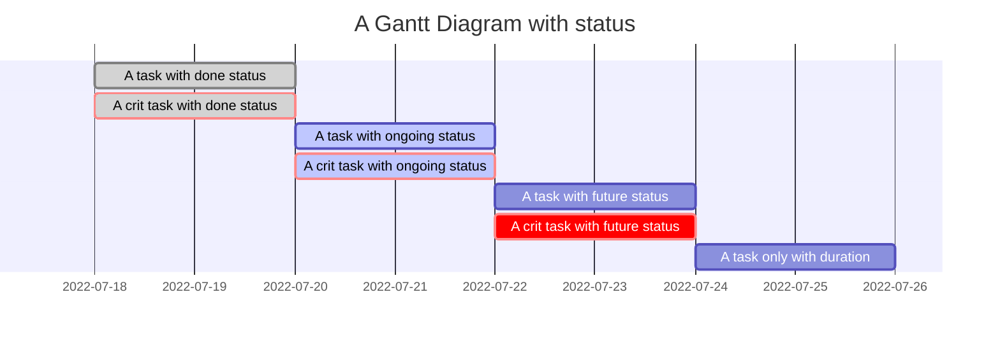


## 5、常见问题

### (1) Flow Chart的节点中显示图片

举个例子[^7]，如下

```html
<body>
  <h2>Embed an image in node</h2>

  <div id="app">
  </div>

  <script src="../vendor/mermaid.min.js"></script>
  <script>
    var mermaidAPI = mermaid.mermaidAPI;

    mermaidAPI.initialize({
      startOnLoad: false
    });

    // https://stackoverflow.com/questions/42402912/how-to-embed-an-image-in-a-node-with-mermaid-js
    var element = document.getElementById("app");
    var insertSvg = function (svgCode, bindFunctions) {
      element.innerHTML = svgCode;
    };
    var graphDefinition = `graph LR; Systemstart-->SomeIcon()`;
    var graph = mermaidAPI.render("mermaid", graphDefinition, insertSvg);
  </script>
</body>
```


mermaid.js加载问题

https://github.com/mermaid-js/mermaid/blob/develop/docs/n00b-gettingStarted.md

```html
<html>

<body>
  <script src="https://cdn.jsdelivr.net/npm/mermaid/dist/mermaid.min.js"></script>
  <script>
    mermaid.initialize({ startOnLoad: true });
  </script>

  Here is one mermaid diagram:
  <div class="mermaid">
    graph TD
    A[Client] --> B[Load Balancer]
    B --> C[Server1]
    B --> D[Server2]
  </div>

  And here is another:
  <div class="mermaid">
    graph TD
    A[Client] -->|tcp_123| B
    B(Load Balancer)
    B -->|tcp_456| C[Server1]
    B -->|tcp_456| D[Server2]
  </div>
</body>

</html>
```


### (2) Flow Chart的节点中字符转义问题

Flow Chart的节点，不是支持所有字符，如果有特殊字符，则考虑用双引号处理一下

举个例子[^8]，如下

```html
<body>
  <script src="../vendor/mermaid.min.js"></script>
  <h2>Gantt Diagram for page event</h2>

  <div class="mermaid">
    graph TD

    question1{"Gas tank less than 1/8?"}
    action1["Fill tank to 100%"]

    question1-- Yes -->action1
  </div>

  <script>
    var config = {
      logLevel: 'debug',
      startOnLoad: true,
      securityLevel: 'loose',
    };
    mermaid.initialize(config);
  </script>
</body>
```


## References

[^1]:https://mermaid-js.github.io/mermaid/#/
[^2]:https://github.com/mermaid-js/mermaid/blob/develop/docs/n00b-overview.md
[^3]:https://mermaid-js.github.io/mermaid/#/Setup?id=startonload
[^4]:https://stackoverflow.com/questions/42402912/how-to-embed-an-image-in-a-node-with-mermaid-js
[^5]:https://mermaid-js.github.io/mermaid/#/gantt 
[^6]:https://mermaid-js.github.io/mermaid/#/Setup?id=mermaidapi-configuration-defaults
[^7]:https://stackoverflow.com/questions/42402912/how-to-embed-an-image-in-a-node-with-mermaid-js
[^8]:https://stackoverflow.com/questions/28121525/mermaid-cli-how-do-you-escape-characters


[]:https://github.com/mermaid-js/mermaid/blob/develop/docs/usage.md


