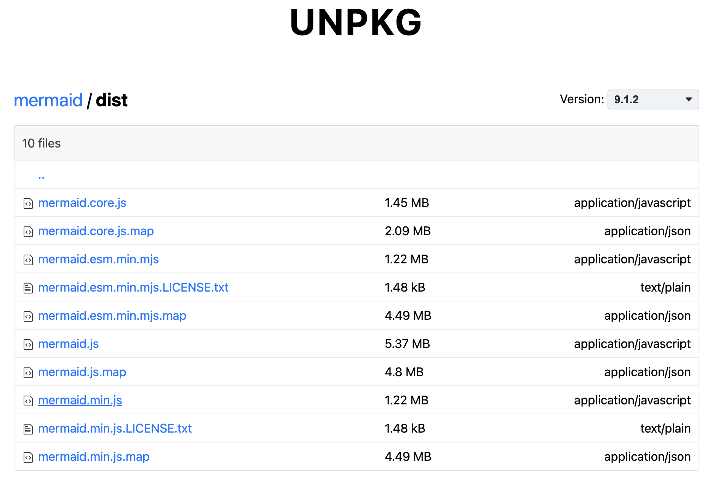
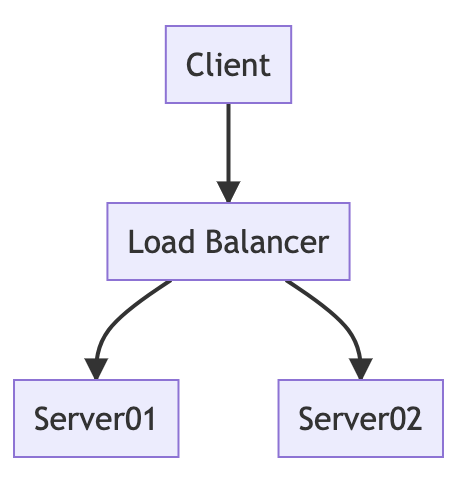

# Hello Mermaid-js

[TOC]

## 1、关于Mermaid-js

Mermaid-js是一个js库，用于通过文本和代码，来创建可视化的图表。

官方文档对Mermaid的定义[^1]，如下

> **Mermaid lets you create diagrams and visualizations using text and code.**
>
> It is a JavaScript based diagramming and charting tool that renders Markdown-inspired text definitions to create and modify diagrams dynamically.


### (1) 诞生原因

Mermaid-js库的诞生原因，即为什么要创作Mermaid-js库来制作图表的原因。

官方给出的原因，如下

> The main purpose of Mermaid is to help documentation catch up with development.
>
> Diagramming and documentation costs precious developer time and gets outdated quickly. But not having diagrams or docs ruins productivity and hurts organizational learning.
> Mermaid addresses this problem by enabling users to create easily modifiable diagrams, it can also be made part of production scripts (and other pieces of code).

简单归纳以下几点

* Mermaid让文档和开发保持与时俱进，避免文档落后开发内容很多
* 编写文档是比较耗费开发宝贵时间的，但是没有文档又会影响其他人学习和沟通，Mermaid让文档更新变得很快
* Mermaid可以作为组件，集成到其他生产环境中


### (2) 集成方式

Mermaid-js支持集成到多种生产环境中，如下

| 容器     | 方式                                                    | 说明 |
| -------- | ------------------------------------------------------- | ---- |
| HTML页面 | `<script></script>`标签方式                             |      |
| webpack  | TODO                                                    |      |
| React    | TODO： https://github.com/mermaid-js/mermaid/issues/717 |      |
| Typora   |                                                         |      |


### (3) 相关学习资料

GitHub源码：https://github.com/mermaid-js/mermaid


## 2、HTML中使用mermaid-js

### (1) CDN下载地址

mermaid-js的生产代码，托管在https://unpkg.com/mermaid/上，如下



可以在上面这个网站找到对应版本的CDN地址，用于script标签上。

说明

> 如果不放心，CDN url可能会被墙，或者访问下载慢，也可以直接下载js文件到本地使用。


### (2) Hello, world示例

结合官方文档提供的代码[^2]，作为Hello, world示例，如下

```html
<!DOCTYPE html>
<html>

<body>
  <div class="mermaid">
    graph TD
    A[Client] --> B[Load Balancer]
    B --> C[Server01]
    B --> D[Server02]
  </div>

  <script src="https://cdn.jsdelivr.net/npm/mermaid/dist/mermaid.min.js"></script>
  <script>
    mermaid.initialize({
      startOnLoad: true,
    });
  </script>
</body>

</html>
```

在浏览器中的显示，如下



这里暂时不讨论mermaid图表语法。主要介绍完成mermaid图表显示的步骤，如下

* 定义好div标签，同时设置它class属性为mermaid。在div中，写入Mermaid text definitions
* 加载mermaid-js库
* 初始化mermaid

说明

> 1. Mermaid text definitions，也称为Mermaid definitions，是官方采用的术语，即mermaid图表语法代码
> 2. 加载mermaid-js库，可以从远端加载，也可以本地加载。这里使用CDN地址，https://cdn.jsdelivr.net/npm/mermaid/dist/mermaid.min.js，应该是官方提供的，总是指向最新版本的。自己的生成环境，可以使用固定版本号。
> 3. mermaid对象，是mermaid-js库提供的全局对象


mermaid对象的initialize方法，用于初始化mermaid，它接收一些参数，比如startOnLoad参数

startOnLoad参数用于决定在page加载时，是否将带有class="mermaid"的div渲染成diagram。

官方文档描述[^3]，如下

> [startOnLoad](https://mermaid-js.github.io/mermaid/#/Setup?id=startonload)
>
> | Parameter   | Description                                  | Type    | Required | Values      |
> | ----------- | -------------------------------------------- | ------- | -------- | ----------- |
> | startOnLoad | Dictates whether mermaid starts on Page load | boolean | Required | true, false |
>
> **Notes:** Default value: true


### (3) 手动渲染

除了指定startOnLoad参数为true，让mermaid自动处理对应div的渲染，也可以手动调用API自己来处理。

举个例子[^4]，如下

```html
<!DOCTYPE html>
<html>

<head>
  <title>manually render into svg</title>
</head>

<body>
  <div id="graphDiv">
  </div>

  <script src="../vendor/mermaid.min.js"></script>
  <script>
    var mermaidAPI = mermaid.mermaidAPI;

    mermaidAPI.initialize({
      startOnLoad: false
    });

    var element = document.getElementById("graphDiv");
    var insertSvg = function (svgCode, bindFunctions) {
      element.innerHTML = svgCode;
    };
    var graphDefinition = 'graph TB\na-->b';
    var graph = mermaidAPI.render("mermaid", graphDefinition, insertSvg);
  </script>
</body>

</html>
```

手动渲染时可以不用设置div的class为mermaid，


### (4) initialize函数的参数

TODO: 

https://mermaid-js.github.io/mermaid/#/Setup?id=configuration


## 3、Diagram Syntax

mermaid-js的Diagram Syntax


Section 1: hello[^1]


1. Div tag

```html
<div class="mermaid">
<!-- mermaid text -->
</div>
```


2. load mermaid script

```html
<script src="https://unpkg.com/mermaid@9.1.2/dist/mermaid.min.js"></script>
<script>mermaid.initialize({
    startOnLoad:true
});
```

CDN:

https://unpkg.com/browse/mermaid@9.1.2/


section2 

securityLevel

- **strict**: (**default**) tags in text are encoded, click functionality is disabled
- **loose**: tags in text are allowed, click functionality is enabled
- **antiscript**: html tags in text are allowed, (only script element is removed), click functionality is enabled
- **sandbox**: With this security level all rendering takes place in a sandboxed iframe. This prevent any JavaScript running in the context. This may hinder interactive functionality of the diagram like scripts, popups in sequence diagram or links to other tabs/targets etc.


initialize函数触发时机

远端css样式

```javascript
$(document).load(function() {
    mermaid.initialize();
});
```

or

```javascript
$(document).ready(function() {
    mermaid.initialize();
});
```


设置css样式

```css
div.mermaid {
    font-family: 'trebuchet ms', verdana, arial;
}
```


放置图片

https://stackoverflow.com/questions/42402912/how-to-embed-an-image-in-a-node-with-mermaid-js


mermaid.js加载问题

https://github.com/mermaid-js/mermaid/blob/develop/docs/n00b-gettingStarted.md

```html
<html>

<body>
  <script src="https://cdn.jsdelivr.net/npm/mermaid/dist/mermaid.min.js"></script>
  <script>
    mermaid.initialize({ startOnLoad: true });
  </script>

  Here is one mermaid diagram:
  <div class="mermaid">
    graph TD
    A[Client] --> B[Load Balancer]
    B --> C[Server1]
    B --> D[Server2]
  </div>

  And here is another:
  <div class="mermaid">
    graph TD
    A[Client] -->|tcp_123| B
    B(Load Balancer)
    B -->|tcp_456| C[Server1]
    B -->|tcp_456| D[Server2]
  </div>
</body>

</html>
```


## References

[^1]:https://mermaid-js.github.io/mermaid/#/
[^2]:https://github.com/mermaid-js/mermaid/blob/develop/docs/n00b-overview.md
[^3]:https://mermaid-js.github.io/mermaid/#/Setup?id=startonload
[^4]:https://stackoverflow.com/questions/42402912/how-to-embed-an-image-in-a-node-with-mermaid-js
[^]:
[^]:https://github.com/mermaid-js/mermaid/blob/develop/docs/usage.md


