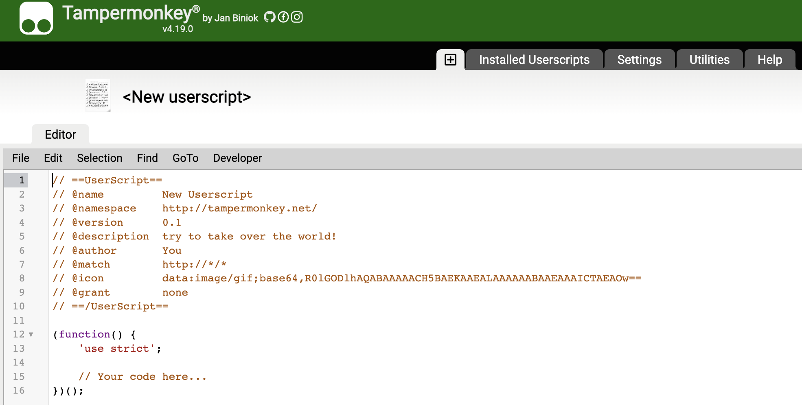
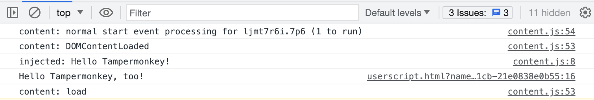

# HelloTampermonkey

[TOC]

## 1、介绍Tampermonkey

Tampermonkey（篡改猴）是Chrome上一款扩展，用于管理和加载自定义的脚本。它的前身是Greasemonkey（油猴），是Firefox上的扩展[^1]。

Tampermonkey在Chome web store上的地址是：https://chrome.google.com/webstore/detail/tampermonkey/dhdgffkkebhmkfjojejmpbldmpobfkfo。

Tampermonkey的主要功能，如下

* 高效管理和编辑自定义脚本
* 快速切换脚本的激活和禁用
* 使用多种云服务同步脚本
* 自动更新脚本

在它的主页上描述[^1]，如下

> 🔑 Key Features:
>
> 🛠️ Efficiently manage and edit your userscripts
> ⚡ Swiftly activate and deactivate scripts with just two clicks
> 🔗 Synchronize scripts using Chrome Sync and various cloud storage services (Google Drive, Dropbox, OneDrive, Yandex.Disk, and WebDAV)
> 💾 Backup and restore options and userscripts through zip files and/or cloud storage
> 🔄 Automatic script updates for a seamless experience

这里补充一下，Tampermonkey管理的自定义脚本，实际允许用户插入自己的脚本，修改任意网站上HTML的DOM结构，到达针对特定网站的自定义功能。


### (1) Tampermonkey安全性

由于Tampermonkey是基于浏览器提供了额外的权限，执行任意脚本，因此存在一定的安全风险。针对Tampermonkey的脚本，网上有两个大的脚本托管网站

* [OpenUserJS](https://openuserjs.org/)
* [GreasyFork](https://greasyfork.org/)

但是安装这些脚本时，一定要认为这些脚本是不安全的，需要阅读安装的脚本全部内容，明白脚本的意图，避免恶意脚本会偷取在浏览器输入的账号、密码、银行卡等重要的个人信息。

参考这篇文章提供的安全建议[^2]，如下

> **Warning! Installing user scripts from others can be very dangerous since they can pretty much do anything such as steal your credit card numbers. Never install a script unless you read the whole thing yourself, understand what it does, and are absolutely sure that you know it isn't doing anything suspicious. Never install a script that contains minified or obfuscated code that you can't read! You have been warned!**

如果不想使用其他人的脚本，可以自己写一个。


### (2) 安装Tampermonkey脚本

安装Tampermonkey脚本，有下面几种方式

* 在[OpenUserJS](https://openuserjs.org/)和[GreasyFork](https://greasyfork.org/)网站上，找到脚本，点击网页上的安装按钮。这种方式会自动触发Tampermonkey扩展，安装脚本。
* 在Tampermonkey的Dashboard上找Utilies tab页，提供几种方式
  * 云链接
  * 本地文件
  * url链接

Utilies tab页，还支持导出已安装的脚本，如下


* 用户自己编写Tampermonkey脚本


### (4) 编写HelloWorld的Tampermonkey脚本

Tampermonkey的Dashboard，点击+号，会自动生成一个用户脚本的模板，如下



上面@tag的形式，这里称为注解。它的用法可以在文档[^3]找到。这里介绍上面用到的一些注解。

| 注解         | 作用                                                         | 示例                                                         |
| ------------ | ------------------------------------------------------------ | ------------------------------------------------------------ |
| @name        | 命名脚本的名字。如果要有国际化，则使用@name:locale_code的形式 | // @name A test<br/>// @name:de Ein Test                     |
| @namespace   | The namespace of the script.                                 |                                                              |
| @version     | 脚本的版本号。具体版本号规则，参考官方文档[^3]               |                                                              |
| @description | 脚本的介绍信息。如果要有国际化，则使用@description:locale_code的形式 | // @description  This userscript does wonderful things<br/> // @description:de Dieses Userscript tut wundervolle Dinge |
| @author      | 脚本的作者                                                   |                                                              |
| @match       | 匹配网站url地址。如果是匹配的，则脚本会生效。具体参考官方文档[^3] | // @match <protocol>://<domain><path>                        |
| @icon        | 脚本的icon                                                   |                                                              |
| @grant       | 声明脚本用到的函数，例如`GM_*`、`GM.*`以及`unsafeWindow`和`window`。具体参考官方文档[^3] | // @grant none                                               |


了解上面的注解含义。下面提供HelloWorld脚本示例，如下

```javascript
// ==UserScript==
// @name         HelloWorld_log
// @namespace    http://tampermonkey.net/
// @version      0.1
// @description  try to take over the world!
// @author       wesley chen
// @match        https://*/*
// @icon         data:image/gif;base64,R0lGODlhAQABAAAAACH5BAEKAAEALAAAAAABAAEAAAICTAEAOw==
// @grant        GM_log
// ==/UserScript==

(function() {
    'use strict';
    GM_log("Hello Tampermonkey!");
    console.log("Hello Tampermonkey, too!");
})();
```

上面定义一个匿名函数，也是一个IIFE(Immediately-invoked Function Expressions)函数[^4]，里面调用GM_log和console对象的log函数。打开任意一个网站，然后打开Chrome的Developer Tools，可以在Console看到下面输出



如果将@grant注解去掉，或写成`@grant none`，则浏览器会报错提示找不到GM_log函数。

说明

> 上面打印日志，可能会有多次，原因是网页用到iframe，需要脚本自行考虑多次运行的问题


## 2、Tampermonkey语法

### (1) Tampermonkey的注解


## 3、Tampermonkey相关文档

* Tampermonkey的注解文档：https://www.tampermonkey.net/documentation.php

* Tampermonkey的常见Q&A文档：https://www.tampermonkey.net/faq.php

由于Tampermonkey的脚本涉及的语法，并不复杂，阅读上面两个文档，基本可以开发脚本。

* Tampermonkey的2.9版本之前的源码：https://github.com/Tampermonkey/tampermonkey


## 4、Tampermonkey常见任务

### (1) 现有页面插入一个banner

举个例子，如下

```javascript
// ==UserScript==
// @name         HelloWorld_banner
// @namespace    http://tampermonkey.net/
// @version      0.1
// @description  try to take over the world!
// @author       wesley chen
// @match        https://*/*
// @icon         data:image/gif;base64,R0lGODlhAQABAAAAACH5BAEKAAEALAAAAAABAAEAAAICTAEAOw==
// @grant        none
// @run-at       document-end
// @require      https://code.jquery.com/jquery-3.6.0.min.js
// ==/UserScript==

(function() {
    'use strict';
    let banner = $("<div id='hello_banner'><p style='color: red;'>Hello Tampermonkey!</p></div>");
    banner.css({
        "display": "flex",
        "align-items": "center",
        "top": "0px",
        "background-color": "#FFFFFF",
        "width": "100%",
        "height": "30px",
        "border": "2px solid red",
        "box-sizing": "border-box",
        "z-index": "10000",
    });
    $('body').prepend(banner);
})();
```

上面通过@require注解，在脚本执行之前，先加载JQuery库，这样用户脚本中可以使用`$`。


## References

[^1]:https://chrome.google.com/webstore/detail/tampermonkey/dhdgffkkebhmkfjojejmpbldmpobfkfo
[^2]:https://codepen.io/rjstone/post/write-a-user-script-with-tampermonkey
[^3]:https://www.tampermonkey.net/documentation.php
[^4]:https://flaviocopes.com/javascript-iife/

